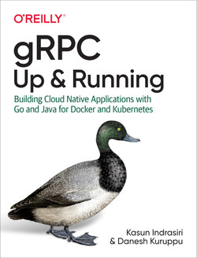

# gRPC up and running

<hr>

###### 🛠️ *References*

- GitHub: [https://github.com/grpc-up-and-running/samples](https://github.com/grpc-up-and-running/samples)
- Postman: [hidden](https://gold-shuttle-395606.postman.co/workspace/My-Workspace~e9564e49-df76-48b9-8f40-1c74ee320241/folder/68565ede55855a1cdfab19a8?action=share&creator=10413281&ctx=documentation&active-environment=10413281-37d0952d-6a07-443b-a8f3-83805f295a77)
<hr>

# 🔧 Installation necessary tools:
- Download and install the latest protocol buffer version 3 compiler from the [GitHub release page](https://github.com/protocolbuffers/protobuf/releases). Then run this command:
  ```bash
  # macOS
  brew install protobuf

  # Linux
  unzip protoc-*-linux-x86_64.zip -d $HOME/.local
  echo 'export PATH="$PATH:$HOME/.local/bin"' >> $HOME/.zshrc
  source $HOME/.zshrc
  ```
  
- Install the gRPC library using the following command:
  ```bash
  go get -u google.golang.org/grpc
  ```
  
- Install the protoc plug-in for Go using the following command:
  ```bash
  go install google.golang.org/protobuf/cmd/protoc-gen-go@latest
  go install google.golang.org/grpc/cmd/protoc-gen-go-grpc@latest
  echo 'export PATH="$PATH:$(go env GOPATH)/bin"' >> $HOME/.zshrc
  source $HOME/.zshrc

  # Verfication
  protoc-gen-go --version
  protoc-gen-go-grpc --version
  ```

# ✅ Completed chaps
- [x] [**Chap 01**](./chap01/README.md): Introduction to gRPC and Protocol Buffers
- [x] [**Chap 02**](./chap02/README.md): Implementing a Simple gRPC Service
- [x] [**Chap 03**](./chap03/README.md): Implementing a gRPC Service with Advanced Features
  - [x] Unary RPC
  - [x] Server Streaming RPC
  - [x] Client Streaming RPC
  - [x] Bidirectional Streaming RPC
- [x] [**Chap 04**](./chap04/README.md): gRPC - Under the hood
- [x] [**Chap 05**](./chap05/README.md): gRPC - Beyond the Basics
  - [x] [Interceptors](./chap05/interceptors/)
  - [x] [Deadlines](./chap05/deadlines/)
  - [x] [Cancellation](./chap05/cancellation/)
  - [x] [Multiplexing](./chap05/multiplexing/)
  - [x] [Metadata](./chap05/metadata/)
  - [x] [Load Balancing](./chap05/loadbalancer/)
- [x] [**Chap 06**](./chap06/README.md): Secured gRPC
  - [x] [One-Way Secured Connection with TLS](./chap06/secure-channel/)