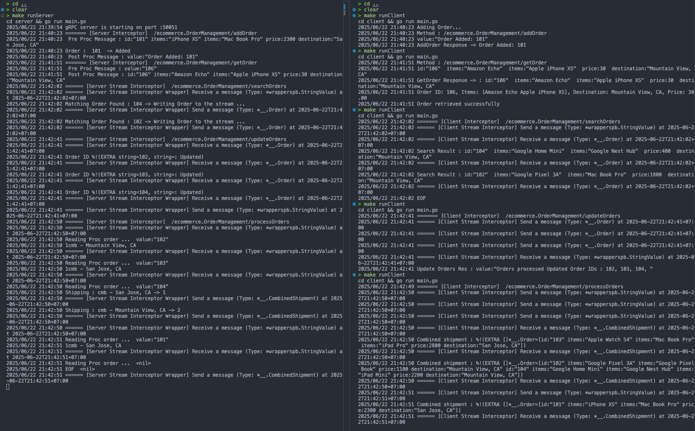
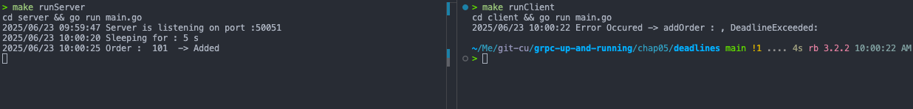
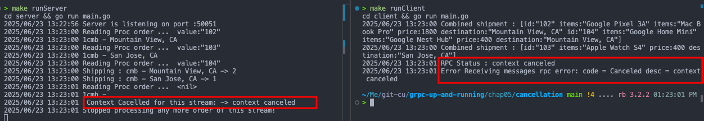
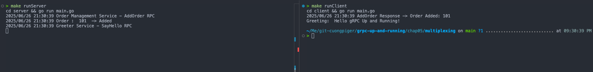
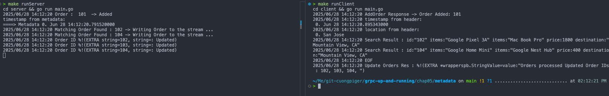

# Interceptors

In Go, **interceptors** in gRPC provide a mechanism to execute common logic **before or after the execution of a remote function** for both client and server applications. They are considered a key extension mechanism for purposes like logging, authentication, metrics, and tracing.

Go interceptors are categorized into two main types based on the RPC call they intercept:

- **Unary Interceptors**: These are used for simple request-response RPCs.

  - **Server-Side**: You implement a function of type `UnaryServerInterceptor`. This function receives the `context.Context`, the request, server information, and a `UnaryHandler` that is used to invoke the actual RPC method. You can add preprocessing logic before calling `handler(ctx, req)` and postprocessing logic after. They are registered with the gRPC server using `grpc.UnaryInterceptor()` when creating the server instance.
  - **Client-Side**: You implement a function of type `UnaryClientInterceptor`. This function gives you access to the RPC context, method name, request, reply, client connection, and an `UnaryInvoker` to call the actual remote method. You can modify the RPC call before it's sent and process the response or error afterward. They are registered using `grpc.WithUnaryInterceptor()` when setting up the client connection via `grpc.Dial`.

- **Streaming Interceptors**: These intercept streaming RPCs (server-streaming, client-streaming, or bidirectional-streaming).
  - **Server-Side**: You implement a function of type `StreamServerInterceptor`. Within this interceptor, a `wrappedStream` that implements `grpc.ServerStream` is often used to intercept the `RecvMsg` (for incoming messages) and `SendMsg` (for outgoing messages) methods. This allows you to process messages as they are received or sent over the stream. They are registered using `grpc.StreamInterceptor()` when creating the gRPC server.
  - **Client-Side**: You implement a function of type `StreamClientInterceptor`. Similar to the server side, a `wrappedStream` that implements `grpc.ClientStream` can be used to intercept `RecvMsg` and `SendMsg` for client-side stream operations. They are registered using `grpc.WithStreamInterceptor()` when dialing the gRPC connection.

The Go gRPC Middleware project further extends this concept by providing **interceptor chaining**, allowing you to apply multiple interceptors sequentially for both unary and streaming RPCs on both the client and server sides.

My demonstration of interceptors in this chapter includes:

# Deadlines

In the "Deadlines" section of Chapter 5, the following important knowledge is presented regarding Go (Golang):

- **Deadlines** are a crucial concept in distributed computing, specifically in gRPC applications, allowing a client to specify an **absolute time by which an RPC must complete**. This is distinct from timeouts, which are durations applied locally.
- It is considered **good practice to use deadlines** in gRPC applications to prevent clients from infinitely waiting for responses, which can lead to resource exhaustion and increased latency.
- In **Go**, setting a deadline for an RPC is achieved using the `context` package, specifically with the **`context.WithDeadline`** operation. This operation creates a new context with a specified absolute time.
- When a deadline is set by the client and the RPC does not complete within that time, the RPC call is **terminated with a `DEADLINE_EXCEEDED` error**.
- The **gRPC library on the client side translates the deadline** set in the context into a required gRPC header at the wire level (on HTTP/2).
- On the **server side (in Go)**, you can detect if the client has reached its deadline by checking **`ctx.Err() == context.DeadlineExceeded`** within the remote method implementation. This allows the server to abandon the RPC if the client no longer needs the response, returning an error.

My demonstration of deadlines in this chapter includes:

# Cancellation

In Go, **cancellation** provides a mechanism for either the client or the server application to **terminate ongoing gRPC communication**. This is crucial because, in a gRPC connection, both the client and server independently determine the success of an RPC, meaning their conclusions about its outcome might differ. When one party cancels an RPC, this fact is **propagated to the other side**, and no further RPC-related messaging can occur for that call.

Here's how cancellation is handled in Go:

- **Context Package**: The capability for cancellation in Go is provided through the **`context` package**. Specifically, the `context.WithCancel` function (or `context.WithTimeout`, which implicitly includes cancellation functionality) is used to create a new context with a cancel function.
- **Client-Side Initiation**: On the client side, after obtaining the `cancel` function from a `context.WithTimeout` or `context.WithCancel` call, the client can invoke this `cancel()` function at any point when it wishes to terminate the RPC. This action leads the gRPC library on the client side to **create a required gRPC header** to signal the termination to the server.
- **Server-Side Detection**: On the server side, the remote method implementation can **detect if the client has canceled the RPC** by checking the context using `stream.Context().Err() == context.Canceled`. This allows the server to abandon its processing for that RPC if the client no longer requires a response, preventing unnecessary resource usage.

In essence, cancellation is a fundamental feature for robust distributed systems, enabling graceful termination of RPCs and preventing resource leaks when either party no longer needs to continue the communication.

My demonstration of cancellation in this chapter includes:

# Error Handling

When handling errors in gRPC applications, especially focusing on Go, it's crucial to remember the following key knowledge:

- **Error Reporting**
  - When a gRPC call is invoked, the client will receive either a successful status or an error with a corresponding error status. Both client and server applications must be designed to gracefully handle these potential errors and conditions.
- **Status Object Structure**
  - gRPC returns an **error status object**. This object is comprised of an **integer code** and an **optional string message** that provides more detailed information about the error condition. These components are consistent across all gRPC implementations for different languages.
- **Well-Defined Status Codes**
  - gRPC utilizes a predefined set of status codes. Some common examples mentioned in the sources include:
    - **OK (0)**: Indicates a successful status, not an error.
    - **CANCELLED (1)**: The operation was canceled, typically by the caller.
    - **UNKNOWN (2)**: An unknown error occurred.
    - **INVALID_ARGUMENT (3)**: The client provided an invalid argument.
    - **DEADLINE_EXCEEDED (4)**: The deadline expired before the operation could be completed. This is particularly relevant given our previous discussion on deadlines.
    - **NOT_FOUND (5)**: A requested entity was not found.
    - **ALREADY_EXISTS (6)**: The entity a client tried to create already exists.
    - **PERMISSION_DENIED (7)**: The caller lacks permission to execute the specified operation.
    - **UNAUTHENTICATED (16)**: The request does not have valid authentication credentials for the operation.
    - **RESOURCE_EXHAUSTED (8)**: A resource has been exhausted.
    - **UNIMPLEMENTED (12)**: The operation is not implemented or supported in this service.
    - **INTERNAL (13)**: Indicates internal errors.
    - **UNAVAILABLE (14)**: The service is currently unavailable.
  - A comprehensive list of error codes can be found in the official gRPC documentation [295, Table 5-1].
- **Richer Error Model**
  - For applications utilizing protocol buffers, a richer error model provided by Google APIs under the `google.rpc` package can be used. This model is supported in **Go** (along with C++, Java, Python, and Ruby).
- **Server-Side Error Creation and Propagation (Go Specific)**
  - Servers should generate appropriate errors with corresponding status codes.
  - In Go, errors can be created using functions from gRPC's `status` package, such as `status.New`, by specifying the error code and details.
  - To include a richer error model, you can add error details with specific error types. For instance, the source demonstrates adding `BadRequest_FieldViolation` from `google.golang.org/genproto/googleapis/rpc/errdetails`.
  - These errors are then returned to the client, for example, using **`return nil, errorStatus.Err()`**.
  - gRPC error status and details are typically transmitted via the **trailer headers** at the transport protocol level.
  - Servers can also detect when a client has reached a deadline by checking `ctx.Err() == context.DeadlineExceeded` (often using a nonblocking `select` construct in Go) and abandon the RPC if necessary.
- **Client-Side Error Handling (Go Specific)**
  - The client processes the error that is returned as part of the RPC invocation.
  - The `grpc/status` package in Go can be used to obtain the error code (e.g., **`status.Code(addOrderError)`**).
  - Clients can also convert the error to a `status.Status` object (e.g., `status.Convert(addOrderError)`) and iterate through its `Details()` to check for and handle specific richer error types like `BadRequest_FieldViolation`.
- **Best Practices**
  - It is generally recommended to **use appropriate gRPC error codes** and leverage a **richer error model** whenever feasible for your gRPC applications.

My demonstration of error handling in this chapter includes:

# Multiplexing

Multiplexing in gRPC, as discussed in Chapter 5, refers to the capability to **run multiple gRPC services on the same gRPC server** and to **use the same gRPC client connection for multiple gRPC client stubs**. This feature is particularly useful in managing distributed applications.

Here's a breakdown focusing on Go:

- **Server-Side Multiplexing**:

  - You can register multiple gRPC services on a single gRPC server instance.
  - This is achieved by calling their respective `Register...Server` functions on the same `grpc.NewServer()` instance,.
  - For example, if you have an `OrderManagementService` and a `GreeterService`, you would register both using `ordermgt_pb.RegisterOrderManagementServer(grpcServer, &orderMgtServer{})` and `hello_pb.RegisterGreeterServer(grpcServer, &helloServer{})` on the same `grpcServer`,.

- **Client-Side Multiplexing**:

  - Similarly, a single gRPC connection can be shared and used by multiple gRPC client stubs.
  - This means you can create a single `grpc.ClientConn` and then use that same connection when initializing different service clients, such as `pb.NewOrderManagementClient(conn)` and `hwpb.NewGreeterClient(conn)`,.

- **Design Considerations and Best Practices**:
  - While gRPC allows for multiplexing, it's a design choice and **it's common in microservices to not share the same gRPC server instance between two services**.
  - A **powerful use case** for gRPC multiplexing in a microservice architecture is to **host multiple major versions of the same service within a single server process**. This allows a service to continue accommodating legacy clients even after breaking API changes are introduced. The older version of the service contract can then be removed once it's no longer in use.

My demonstration of multiplexing in this chapter includes:

# Metadata

Metadata in gRPC, as discussed in Chapter 5, serves as a mechanism to **share information about RPC calls that is not directly related to the business context of the RPC arguments**. This means you can send or receive data from either the gRPC service or the gRPC client, even if that data isn't part of the remote method's input or output parameters. This information is structured as a **list of key (string)/value pairs**. One of the most common applications for metadata is the **exchange of security headers** between gRPC applications. Metadata APIs are frequently utilized within interceptors.

Focusing on **Go**:

- **Metadata Structure and Creation**:

  - In Go, metadata is represented as a **normal map**.
  - You can create metadata in two primary ways:
    - Using `metadata.New(map[string]string{"key1": "val1", "key2": "val2"})`.
    - Using `metadata.Pairs("key1", "val1", "key1", "val1-2", "key2", "val2")`. This method merges values for the same key into a list (e.g., "key1" would have the value `[]string{"val1", "val1-2"}`).
  - **Binary data can also be set as metadata values**; it will be base64 encoded before transmission and decoded upon reception.

- **Retrieving Metadata (Client and Server Side)**:

  - Metadata can be retrieved from the **incoming context of the RPC call** using `metadata.FromIncomingContext(ctx)`. This function returns the metadata map in Go.

- **Sending Metadata from the Client Side**:

  - Metadata is sent from the client by **setting it into the context of the RPC call**.
  - There are two methods to achieve this in Go:
    - `metadata.NewOutgoingContext(context.Background(), md)`: This creates a **new context with the new metadata**, effectively replacing any existing metadata in the context.
    - `metadata.AppendToOutgoingContext(mdCtx, "k1", "v1", "k1", "v2", "k2", "v3")`: This allows you to **append additional metadata** to an existing context.
  - Once a context is created with the necessary metadata, it can be used for both **unary or streaming RPCs**.
  - At the wire level, the metadata set in the context is translated into **gRPC headers (on HTTP/2) or trailers**.

- **Receiving Metadata on the Client Side**:

  - When receiving metadata from the server, clients treat them as either **headers or trailers**.
  - For **unary RPCs**, you pass references to `metadata.MD` variables to the `grpc.Header(&header)` and `grpc.Trailer(&trailer)` options during the RPC call to store the returned values.
  - For **streaming RPCs**, you can retrieve headers using `stream.Header()` and trailers using `stream.Trailer()` from the client stream object.
  - The retrieved metadata can then be processed as a generic map.

- **Sending Metadata from the Server Side**:
  - Servers can send metadata by either sending it as a **header with metadata** or by **setting a trailer with metadata**.
  - The metadata creation method is the same as discussed for the client side.
  - In Go, for both unary and streaming cases, you can send headers using `grpc.SendHeader(ctx, header)` or `stream.SendHeader(header)`.
  - To send metadata as part of the trailer, you use `grpc.SetTrailer(ctx, trailer)` for unary RPCs or `stream.SetTrailer(trailer)` for streaming RPCs, of the respective stream's context.

My demonstration of metadata in this chapter includes:
