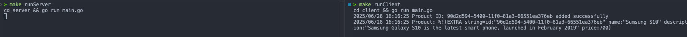
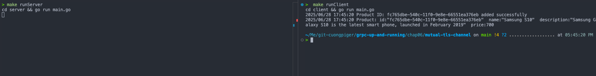
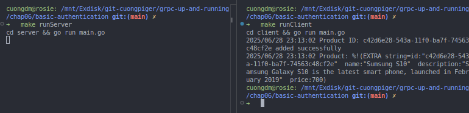

# Enabling a One-Way Secured Connection

The "Enabling a One-Way Secured Connection" section in Chapter 6 focuses on how to establish **Transport Level Security (TLS)** for gRPC communication where **only the client validates the server's identity**. This ensures that the client is indeed communicating with the intended server, providing privacy and data integrity through symmetric cryptography and message integrity checks.

Here's a summary of the key information:

- **Purpose**: In a one-way secured connection, the primary goal is for the client to **validate the server's identity**. This is crucial for ensuring that data is received from a trusted source.
- **Mechanism**: When a connection is established, the server shares its **public certificate** with the client. The client then validates this certificate, often through a Certificate Authority (CA) if it's a CA-signed certificate. Once validated, the client can send encrypted data using a secret key negotiated for the session.
- **Required Keys and Certificates**: To enable TLS, you need to create:
  - `server.key`: A private RSA key used to sign and authenticate the public key.
  - `server.pem`/`server.crt`: Self-signed X.509 public keys for distribution.
  - Tools like OpenSSL, mkcert, or certstrap can be used for generating these keys and certificates.
- **Enabling on a gRPC Server (Go example)**:
  - The server must be initialized with a **public/private key pair**.
  - In Go, this involves loading the X.509 key pair (`server.crt` and `server.key`).
  - Then, you enable TLS for incoming connections by adding these certificates as **TLS server credentials** using `grpc.Creds(credentials.NewServerTLSFromCert(&cert))` when creating a new gRPC server instance.
- **Enabling on a gRPC Client (Go example)**:
  - The client needs the **server's self-certified public key** to connect securely.
  - In Go, you create client TLS credentials from the server's public certificate file (`server.crt`) using `credentials.NewClientTLSFromFile(crtFile, hostname)`.
  - These transport credentials are then passed as a **DialOption** (`grpc.WithTransportCredentials(creds)`) when setting up a secure connection with the server using `grpc.Dial`. This process initiates the TLS handshake.

It's important to note that this one-way TLS authentication **only authenticates the server's identity** to the client; it does not authenticate the client's identity to the server.

The implementation is located in the [secure-channel](./secure-channel) directory.

My demonstration of load balancing in this chapter includes:

# Enabling an mTLS Secured Connection

The "Enabling an mTLS Secured Connection" section in Chapter 6 focuses on establishing **mutual Transport Level Security (mTLS)** for gRPC communication.

Here's a summary of the main knowledge presented:

- **Purpose of mTLS**:

  - The primary intent of an mTLS connection is to **control which clients can connect to the server**.
  - Unlike one-way TLS, where only the client authenticates the server, mTLS ensures that **both the client and the server authenticate each other's identities**.
  - This means the server is configured to accept connections only from a limited group of verified clients.

- **Mechanism and Connection Flow**:

  1.  The client initiates a request to access protected information from the server.
  2.  The server responds by sending its X.509 certificate to the client.
  3.  The client then validates the received server certificate, typically through a Certificate Authority (CA) if it's CA-signed.
  4.  If the server's certificate is successfully verified, the client sends its own certificate to the server.
  5.  The server, in turn, verifies the client's certificate, also through the CA.
  6.  Once both verifications are successful, the server grants the client permission to access the protected data.

- **Required Keys and Certificates**:
  To enable mTLS, a set of specific keys and certificates are needed, including:

  - `server.key`: The server's **private RSA key**.
  - `server.crt`: The server's **public certificate**.
  - `client.key`: The client's **private RSA key**.
  - `client.crt`: The client's **public certificate**.
  - `ca.crt`: The **public certificate of the Certificate Authority (CA)** that was used to sign both the client and server public certificates.
    Tools like OpenSSL can be used to generate these.

- **Enabling mTLS on a gRPC Server (Go example)**:

  - The server's main function needs to be updated to **load its X.509 key pair** (`server.crt`, `server.key`).
  - It then creates a **certificate pool** (`x509.NewCertPool()`) and **appends the CA's public certificate** (`ca.crt`) to this pool.
  - Finally, the gRPC server is created with **TLS credentials** (`credentials.NewTLS`) that require and verify the client's certificate (`tls.RequireAndVerifyClientCert`) and use the loaded server certificate and the CA's certificate pool for client validation.

- **Enabling mTLS on a gRPC Client (Go example)**:
  - The client code must also load its **own X.509 key pair** (`client.crt`, `client.key`).
  - Similar to the server, it creates a certificate pool and **appends the CA's public certificate** (`ca.crt`) to this pool.
  - When dialing the gRPC server, the client provides **TLS transport credentials** (`credentials.NewTLS`) that include its own certificate, the CA's certificate pool as the root CAs, and importantly, sets the `ServerName` to match the Common Name on the server's certificate. This initiates the mutual authentication process.

In essence, mTLS provides a higher level of security by ensuring that **both communicating parties can verify each other's identities**, which is crucial for controlling access in a distributed system.

The implementation is located in the [mutual-tls-channel](./mutual-tls-channel) directory.

My demonstration of mTLS in this chapter includes:

# Using Basic Authentication

Basic authentication is a straightforward method for verifying a caller's identity in gRPC, although gRPC generally advises against its use because it lacks time-based control mechanisms like tokens. It is recommended to share basic credentials over a secure connection.

Here's how basic authentication can be implemented in Go for gRPC applications:

- **Client-Side Implementation**:

  - Since gRPC does not have built-in support for basic authentication, you need to add it as **custom credentials**.
  - This is done by defining a struct (e.g., `basicAuth`) that holds user credentials (like username and password).
  - You must then implement the `PerRPCCredentials` interface for this struct, specifically the `GetRequestMetadata` method. This method converts the user credentials into a request metadata map, where the **"authorization" key is set with a value starting "Basic " followed by the base64-encoded "username:password" string**. For example, `Authorization: Basic YWRtaW46YWRtaW4=`.
  - The `RequireTransportSecurity` method of the `PerRPCCredentials` interface should return `true`, emphasizing the recommendation for channel security when using basic authentication.
  - Finally, when setting up the gRPC connection, you pass this initialized authentication struct to `grpc.WithPerRPCCredentials()` as a `DialOption`.

- **Server-Side Implementation**:
  - On the server, you need to **intercept incoming requests** to validate the client's credentials.
  - This is achieved by adding a `grpc.UnaryInterceptor` when creating the gRPC server.
  - Within the interceptor function (e.g., `ensureValidBasicCredentials`), you **extract the metadata from the request's context** using `metadata.FromIncomingContext(ctx)`.
  - The value associated with the "authorization" key (which is normalized to lowercase in metadata) is then retrieved and validated against the expected username and password (e.g., "admin:admin").
  - If the validation fails (e.g., missing metadata or invalid token), the interceptor blocks the request and returns an error (e.g., `codes.InvalidArgument` or `codes.Unauthenticated`).
  - If the credentials are valid, the interceptor allows the request to proceed to the actual service method handler.

The implementation is located in the [basic-authentication](./basic-authentication) directory.

My demonstration of basic authentication in this chapter includes:
