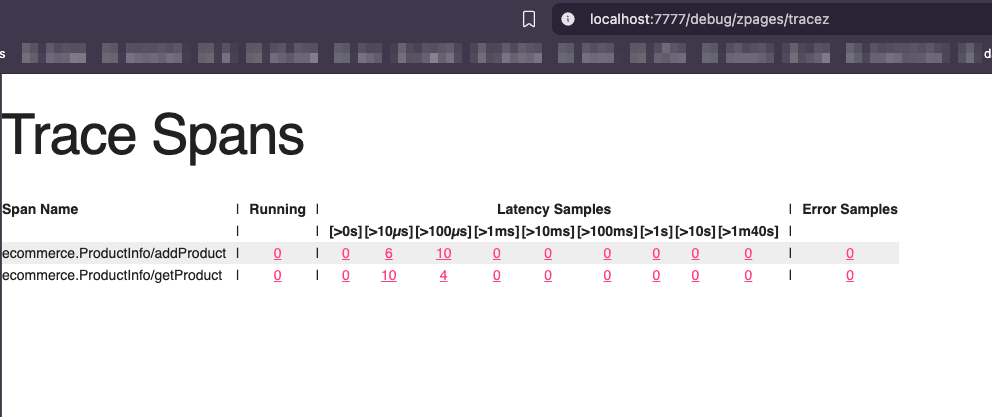

# Installation necessary to run the code in this chapter

Install `mockgen`

```shell
go install go.uber.org/mock/mockgen@latest

brew install ghz
```

# Mocking & Unit testing

- Working directory [`grpc-continous-integration`](./grpc-continous-integration/)

```shell
make test
```


# Load testing

- Working directory [`grpc-continous-integration`](./grpc-continous-integration/)
- Run the `product_info` server

```shell
make runServer

# another terminal
make loadTest
```


# OpenTelemetry for metrics

- Working directory [`grpc-opentelemetry`](./grpc-opentelemetry/)

```shell
make runServer

# another terminal
make runClient
```


- Access the zPages trace visualization at `http://localhost:7777/debug/zpages/tracez`

  

# OpenTelemetry for tracing

- Working directory [`grpc-otel-tracing`](./grpc-otel-tracing/)

```shell
make dockerUp
make runServer
# another terminal
make runClient
```


- Access the Jaeger UI at `http://localhost:16686`

  
  

# Prometheus for metrics
- Working directory [`grpc-prometheus`](./grpc-prometheus/)

```shell
make runServer
# another terminal
make runClient
```


- Access the Prometheus UI at `http://localhost:9092`

  