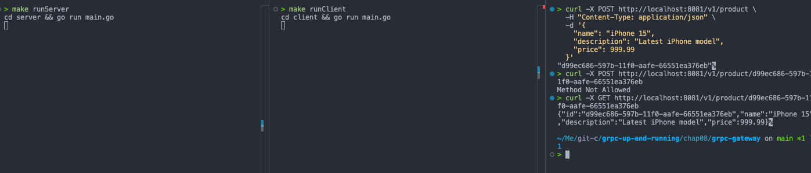

# gRPC gateway

- Working directory: [`chap08/grpc-gateway`](./chap08/grpc-gateway)

- Run the gRPC server and gRPT reverse proxy:

```bash
make runServer

# another terminal
make runClient
```

- Make HTTP requests to the gRPC server:

  - Add a product:

  ```bash
  curl -X POST http://localhost:8081/v1/product \
    -H "Content-Type: application/json" \
    -d '{
      "name": "iPhone 15",
      "description": "Latest iPhone model",
      "price": 999.99
    }'
  ```

  **Response:**

  ```json
  {
    "value": "d99ec686-597b-11f0-aafe-66551ea376eb"
  }
  ```

  > "d99ec686-597b-11f0-aafe-66551ea376eb"%

  - Get a product by ID:

  ```bash
  curl -X GET http://localhost:8081/v1/product/__PRODUCT_ID__

  # example: curl -X GET http://localhost:8081/v1/product/d99ec686-597b-11f0-aafe-66551ea376eb
  ```

  **Response:**

  ```json
  {
    "id": "d99ec686-597b-11f0-aafe-66551ea376eb",
    "name": "iPhone 15",
    "description": "Latest iPhone model",
    "price": 999.99
  }
  ```

  