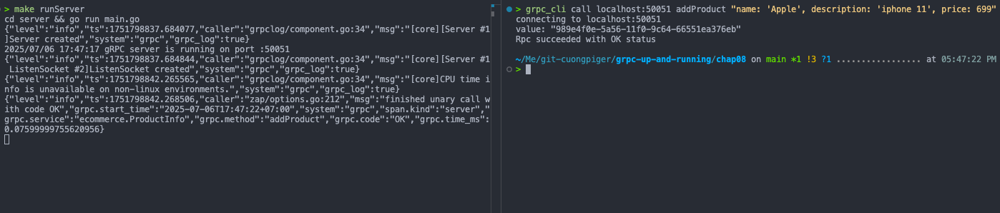

# gRPC gateway

- Working directory: [`chap08/grpc-gateway`](./chap08/grpc-gateway)

- Run the gRPC server and gRPT reverse proxy:

```bash
make runServer

# another terminal
make runClient
```

- Make HTTP requests to the gRPC server:

  - Add a product:

  ```bash
  curl -X POST http://localhost:8081/v1/product \
    -H "Content-Type: application/json" \
    -d '{
      "name": "iPhone 15",
      "description": "Latest iPhone model",
      "price": 999.99
    }'
  ```

  **Response:**

  ```json
  {
    "value": "d99ec686-597b-11f0-aafe-66551ea376eb"
  }
  ```

  > "d99ec686-597b-11f0-aafe-66551ea376eb"%

  - Get a product by ID:

  ```bash
  curl -X GET http://localhost:8081/v1/product/__PRODUCT_ID__

  # example: curl -X GET http://localhost:8081/v1/product/d99ec686-597b-11f0-aafe-66551ea376eb
  ```

  **Response:**

  ```json
  {
    "id": "d99ec686-597b-11f0-aafe-66551ea376eb",
    "name": "iPhone 15",
    "description": "Latest iPhone model",
    "price": 999.99
  }
  ```

  

# gRPC Reflection

## Install necessary tools

- Install `grpc_cli` tool to test gRPC services:
  ```shell
  brew install gcc grpc
  ```

## Definition

The gRPC Server Reflection Protocol is a service defined on a gRPC server that provides **information about publicly accessible gRPC services on that server**. Essentially, it allows a client application to communicate with a gRPC service **without needing precompiled service definitions**.

Key aspects of the gRPC Server Reflection Protocol:

- **Purpose**: It provides **service definitions of the services registered on a server to the client application**. This eliminates the need for clients to have prior knowledge or compiled stubs of the service definitions, simplifying communication, especially for debugging tools.
- **Use Case**: It is particularly useful for **building command-line interface (CLI) tools for debugging gRPC servers**. Instead of requiring service definitions, the tool can simply provide the method name and a text payload, send the binary payload to the server, and receive the response in a human-readable format.
- **Enabling on Server Side**: To use server reflection, it must first be **enabled on the server side**. For a Go gRPC server, this involves importing the `reflection` package and registering the reflection service with the gRPC server instance, as shown in the example `reflection.Register(s)`. Server reflection can also be enabled in gRPC Java servers.
- **gRPC CLI Tool**: After enabling server reflection, a gRPC CLI tool can be used to interact with the server. This tool, which needs to be built from its source code, supports various functionalities:
  - **List services**: Displays all public services on a given endpoint.
    `./grpc_cli ls localhost:50051`
    Example output includes `ecommerce.ProductInfo` and `grpc.reflection.v1alpha.ServerReflection`.
  - **List service details**: Inspects a specific service by providing its full name (e.g., `<package>.<service>`).
    `./grpc_cli ls localhost:50051 ecommerce.ProductInfo -l`
    This command shows the RPC methods defined within the service, such as `addProduct` and `getProduct`, along with their input and return types.
  - **List method details**: Provides details for a specific method (e.g., `<package>.<service>.<method>`).
    `./grpc_cli ls localhost:50051 ecommerce.ProductInfo.addProduct -l`
  - **Inspect message types**: Inspects the structure of a message type by its full name (e.g., `<package>.<type>`).
    `./grpc_cli type localhost:50051 ecommerce.Product`
    This would reveal fields like `id`, `name`, `description`, and `price` within the `Product` message.
  - **Call remote methods**: Sends RPC calls to the server and retrieves responses.
    `./grpc_cli call localhost:50051 addProduct "name: 'Apple', description: 'iphone 11', price: 699"`
    `./grpc_cli call localhost:50051 getProduct "value: 'd962db94-d907-11e9-b49b-6c96cfe0687d'"`

## Demonstration

- Run the gRPC server with reflection enabled:

  ```bash
  make runServer
  ```

- Use the `grpc_cli` tool to interact with the server:

  - **List services**: Run the following command to list all public services in endpoint `localhost:50051`:

    ```bash
    > grpc_cli ls localhost:50051
    ecommerce.ProductInfo
    grpc.reflection.v1.ServerReflection
    grpc.reflection.v1alpha.ServerReflection
    ```

  - **List service details**: Run the following command by giving the service's full name (in the format of `<package>.<service>`) to inspect the service:

    ```bash
    > grpc_cli ls localhost:50051 ecommerce.ProductInfo -l
    filename: proto/product_info.proto
    package: ecommerce;
    service ProductInfo {
      rpc addProduct(ecommerce.Product) returns (google.protobuf.StringValue) {}
      rpc getProduct(google.protobuf.StringValue) returns (ecommerce.Product) {}
    }
    ```

  - **List method details**: Run the following command by giving the method's full name (in the format of `<package>.<service>.<method>`) to inspect the method:

    ```bash
    > grpc_cli ls localhost:50051 ecommerce.ProductInfo.addProduct -l
      rpc addProduct(ecommerce.Product) returns (google.protobuf.StringValue) {}
    ```

  - **Inspect message types**: Run the following commands by giving the full name of the message type (in the
    format of `<package>.<type>`) to inspect the message type:
    `bash
    > grpc_cli type localhost:50051 ecommerce.Product
    message Product {
      string id = 1 [json_name = "id"];
      string name = 2 [json_name = "name"];
      string description = 3 [json_name = "description"];
      float price = 4 [json_name = "price"];
    }
    `

  - **Call remote methods**: Run the following commands to send remote calls to the server and get the response:

    - Call the `addProduct` method in the `ProductInfo` service:

      ```bash
      > grpc_cli call localhost:50051 addProduct "name: 'Apple', description: 'iphone 11', price: 699"
      connecting to localhost:50051
      value: "05ada7d6-5a55-11f0-a6d7-66551ea376eb"
      Rpc succeeded with OK status
      ```

    - Call the `getProduct` method in the `ProductInfo` service:
      ```bash
      > grpc_cli call localhost:50051 getProduct "value: '05ada7d6-5a55-11f0-a6d7-66551ea376eb'"
      connecting to localhost:50051
      id: "05ada7d6-5a55-11f0-a6d7-66551ea376eb"
      name: "Apple"
      description: "iphone 11"
      price: 699
      Rpc succeeded with OK status
      ```

# gRPC Middlewares

- Working directory: [`chap08/grpc-middlewares`](./chap08/grpc-middlewares)
- Run the gRPC server with middlewares enabled:

  ```bash
  make runServer
  ```

- Make a gRPC request to the server:

  ```bash
  > grpc_cli call localhost:50051 addProduct "name: 'Apple', description: 'iphone 11', price: 699"
  connecting to localhost:50051
  value: "989e4f0e-5a56-11f0-9c64-66551ea376eb"
  Rpc succeeded with OK status
  ```

  